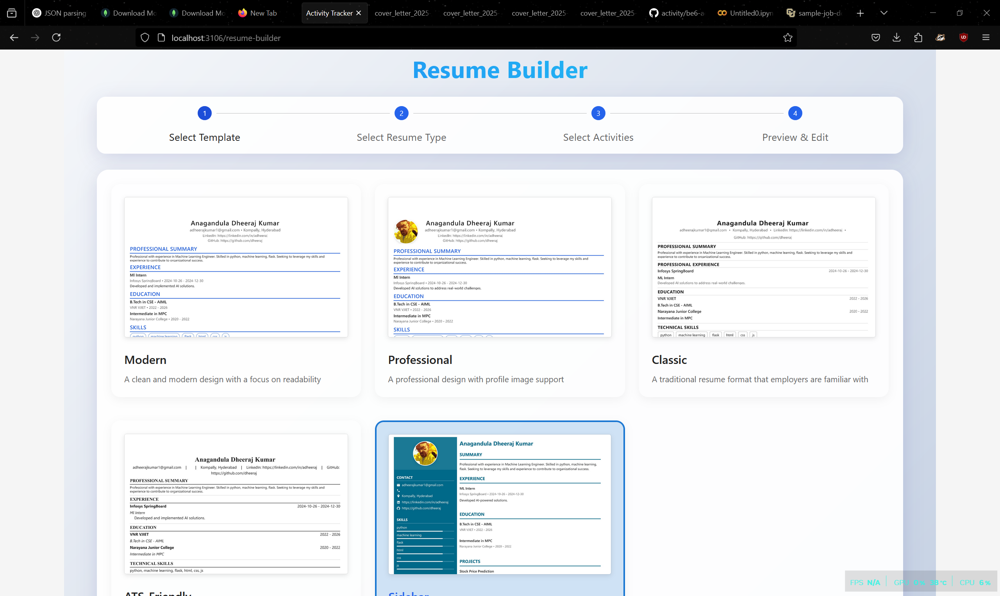
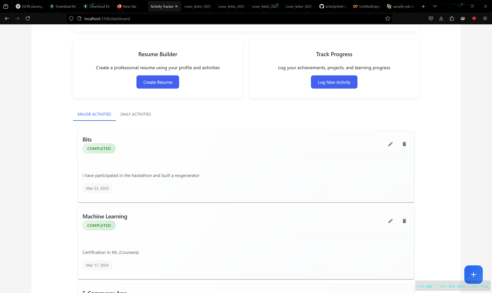
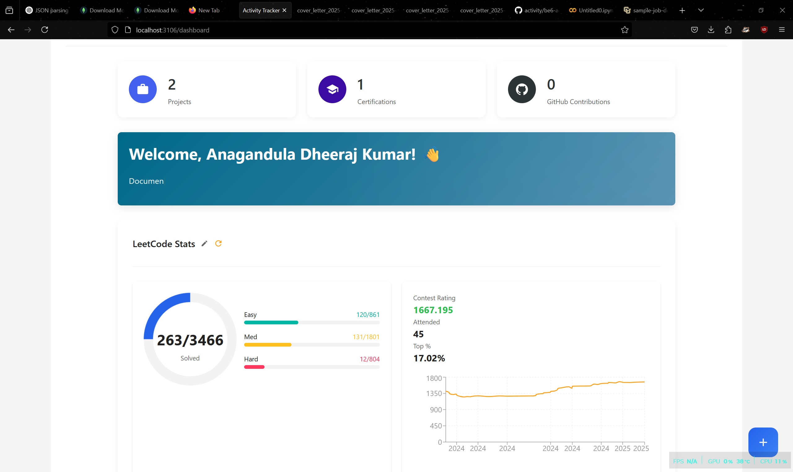
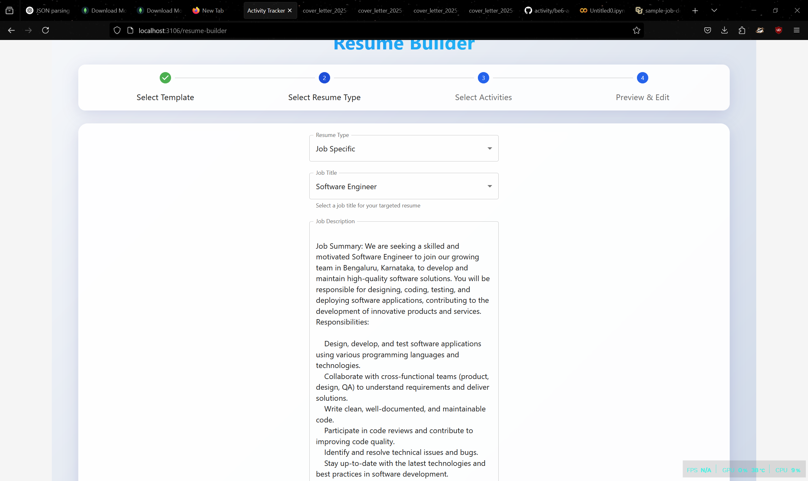
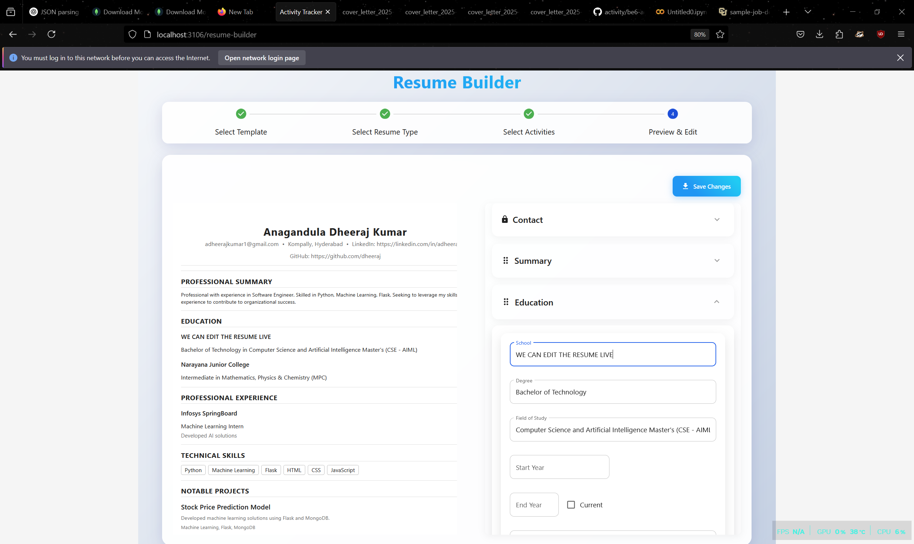
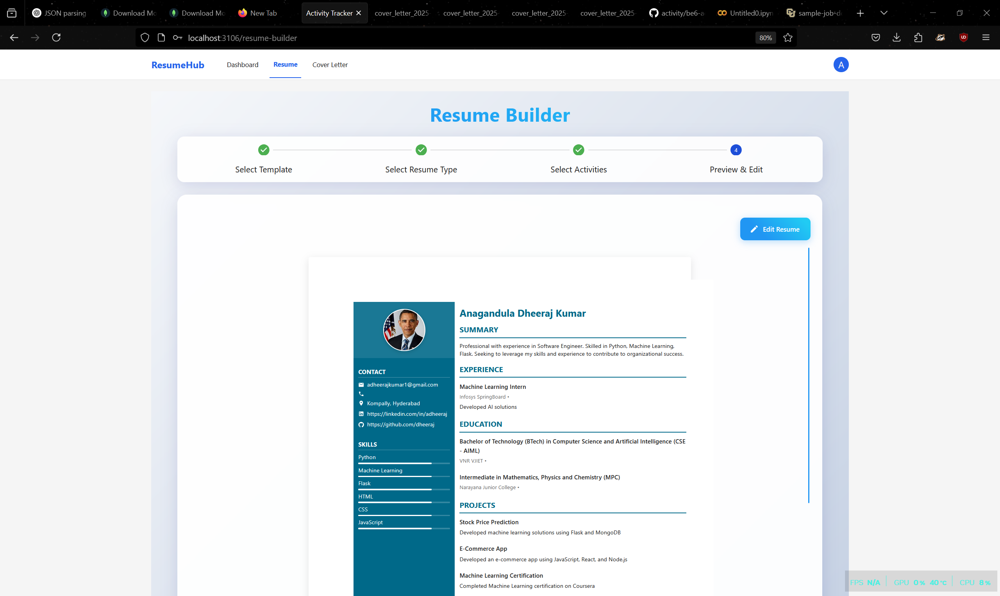
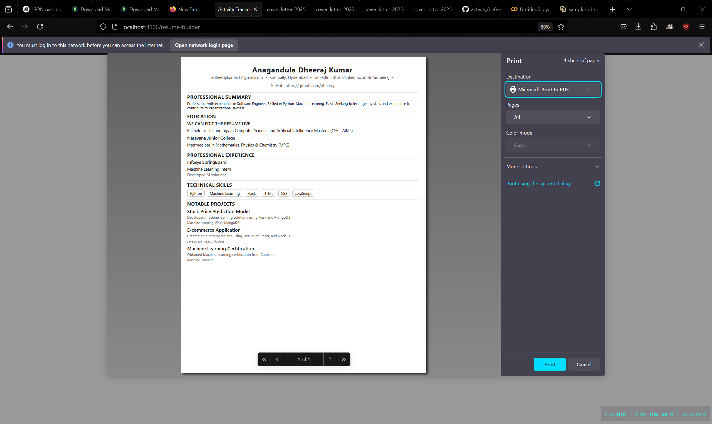

# 🚀 AI-Powered Activity Logger & Resume Generator


[](https://www.python.org/)
[](https://react.dev/)

## 🏆 Highlights
- **Core Innovation**: AI-powered activity tracking with resume generation
- **Key Achievement**: Local LLM integration for privacy-focused processing
- **Tech Stack**: Full-stack implementation with Mistral 7B fine-tuning

## ✨ Implemented Features


- **📝 Smart Activity Logging**
  - Code session tracking with automatic time-stamping
  - Project milestone documentation
  - Context capture for work artifacts (commits, tickets, PRs)

- **🤖 AI-Powered Document Engine**
  - **Resume Features**
    - JD-based resume optimization
    - Skills gap analysis with improvement suggestions
    - LaTeX template integration (3+ templates)
  - **Cover Letter Features**
    - Position-specific letter generation
    - Tone customization (formal/creative/technical)
    - ATS keyword optimization

- **🔒 Local AI Processing**
  - Mistral 7B fine-tuned for document generation
  - Ollama-based local inference
  - Privacy-focused data processing
  - Offline operation capability


## 🖼️ Visual Walkthrough

### DEMO OF RESUMEHUB


### 1. Activity Tracking Interface

**Key Features:**
- Comprehensive activity timeline with color-coded categories
- Daily coding hour breakdown (right panel)
- Quick-add activity button (floating action button)

### 2. Real-time Dashboard

**Visible Metrics:**
- Weekly activity distribution chart
- Skill proficiency progress bars
- Project completion rate gauge

### 3. Resume Customization

**Template Options:**
- Modern, Professional, and Creative layouts
- Live preview thumbnails
- One-click template switching

### 4. Job-Specific Optimization

**AI-Powered Features:**
- Job description keyword extraction
- Skills matching percentage
- Suggested improvements (red/yellow/green indicators)

### 5. Interactive Editing

**Editing Tools:**
- Drag-and-drop section reordering
- Real-time content validation
- AI suggestions toggle (right panel)

### 6. Visual Resume Output

**Design Elements:**
- Profile image integration
- Skill proficiency meters
- Clean typography and spacing

### 7. Export Options

**Available Formats:**
- PDF (print-ready)
- LaTeX source files
- PNG image export

## ⚙️ Installation

```bash
# Clone repository
git clone https://github.com/your-repo/activity-logger.git
cd activity-logger

# Backend setup
pip install -r requirements.txt
flask run --port=5000

# Frontend setup
cd frontend
npm install
npm run dev

# Run AI Model (separate terminal)
ollama run mistral-7b-custom
```

## 🖥️ Usage Demo


1. **Log Activities** through web interface
2. **Upload Job Description** for analysis
3. **Generate Tailored Resume** with AI suggestions
4. **Export PDF/LateX** documents

## 🛠️ Tech Stack
**Core AI**  


**Frontend**  


**Backend**  


## 📄 License
MIT Licensed - See [LICENSE](LICENSE) for details.

---

🏆 **Developed for BITS Hackathon 2025**  
💡 Try our live demo: [demo.example.com](https://demo.example.com) | ⭐ Star us on GitHub!
